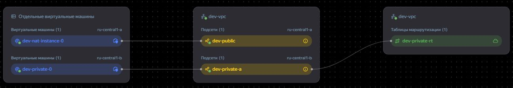

# Организация сети
### Задание 1

1. Модуль [modules/network](https://github.com/alex-bel31/cloud/blob/main/01-network/modules/network) создает сетевую инфраструктуру:

    - `yandex_vpc_network` — создание VPC

    - `yandex_vpc_gateway` — опционально: NAT Gateway

    - `yandex_vpc_route_table` — маршрутизация приватных подсетей

    - `yandex_vpc_subnet` — публичные и приватные подсети

    Поддерживает два режима NAT:

    1. ` NAT Gateway (use_nat_gateway = true)`

    2. `NAT Instance (use_nat_instance = true, nat_instance_address = "...")`

    При использовании NAT Instance маршруты направляются на указанный приватный IP NAT-инстанса.

    Вызов модулей в [main.tf](https://github.com/alex-bel31/cloud/blob/main/01-network/main.tf)

    <center>
    
    </center>  

2. Подключение к машине в приватной подсети через **ssh config**:

    ```bash 
    Host bastion
        HostName 84.201.133.152
        User ubuntu
        IdentityFile ~/.ssh/yavm

    Host vm-internal
        HostName 192.168.20.25
        User ubuntu
        ProxyJump bastion
        IdentityFile ~/.ssh/yavm
    ```

3. Проверка доступа в интернет через машину в приватной подсети:

    <center>
    
    </center>    
