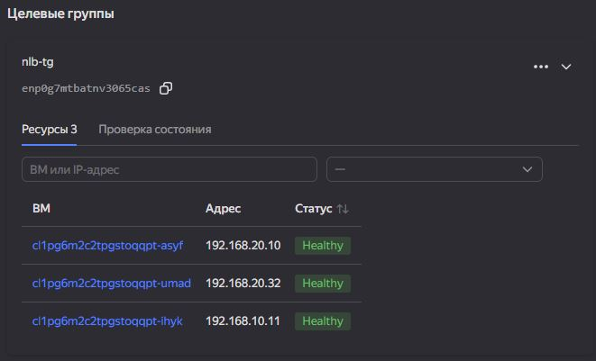

# Вычислительные мощности. Балансировщики нагрузки
### Задание 1

1. Создан бакет Object Storage. В бакет загружен файл с картинкой с помощью ресурса `yandex_storage_object`:

2. Создана Instance Group из 3 виртуальных машин. Использован LAMP-образ. ВМ размещены в публичных подсетях модуля `network` в зонах `ru-central1-a` и `ru-central1-b`. Для установки стартовой страницы используется блок `metadata.user-data`, загружающий cloud-init шаблон:

    ```hcl
    metadata = {
        user-data = templatefile("${path.module}/templates/cloud-init.tpl", {...})
    }
    ```

    Внутри cloud-init создаётся `index.html` с ссылкой на картинку из Object Storage.

    Для Instance Group включена проверка состояния и автоматическое формирование Target Group:

    ```hcl
    load_balancer {
        target_group_name = "nlb-tg"
    }
    ```
    <center>
    
    </center>    

3. Создан сетевой балансировщик и подключена целевая группа Instance Group:

    ```hcl
    target_group_id = yandex_compute_instance_group.tg_1.load_balancer.0.target_group_id
    ```

    Настроен HTTP-healthcheck:

    ```hcl
    healthcheck {
      name = "http"
      http_options {
        port = 80
        path = "/"
      }
      interval = 5
      timeout  = 3
      healthy_threshold   = 2
      unhealthy_threshold = 2
    }
    ```
    <center>
    
    </center>    
