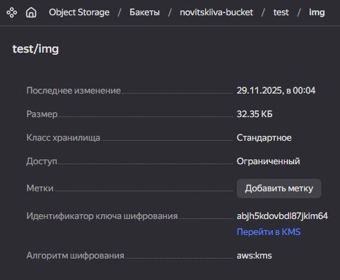

# Безопасность в облачных провайдерах

### Задание 1. KMS

1. С помощью ресурса `yandex_kms_symmetric_key` был создан KMS Symmetric Key
2. Был создан бакет, который автоматически шифрует все загруженные в него объекты KMS-ключом.

    [main.tf](https://github.com/alex-bel31/cloud/blob/main/03-security/main.tf)

    

    
    
    
