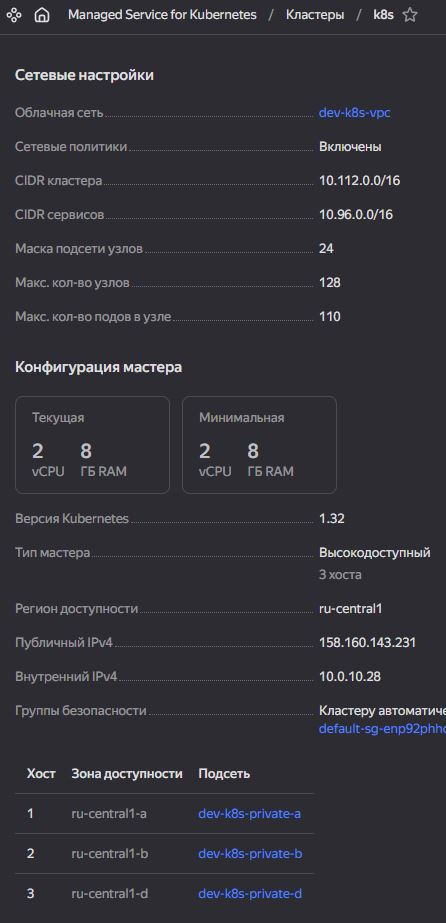
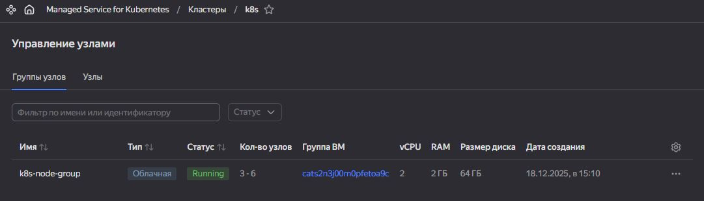
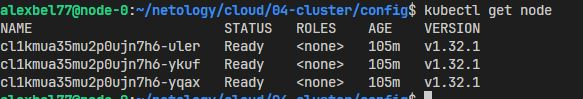
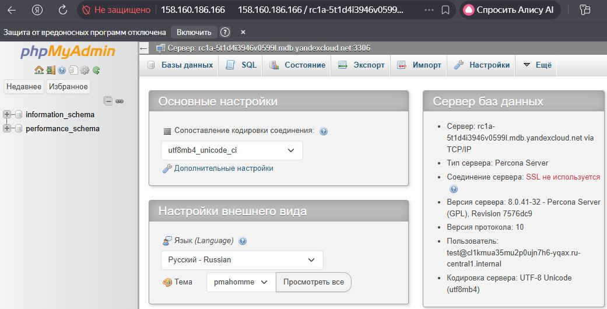

# Кластеры. Ресурсы под управлением облачных провайдеров

### Задание 1. Yandex Cloud

1. **Кластер баз данных MySQL**

    - Для MDB был создан отдельный Terraform модуль [modules/mysql](https://github.com/alex-bel31/cloud/blob/main/04-cluster/modules/mysql), который позволяет:
        - Развернуть кластер MySQL в VPC с приватными подсетями в разных зонах для отказоустойчивости.
        - Размещать ноды в разных подсетях.
        - Настроить репликацию и время технического обслуживания.
        - Указывать параметры окружения, платформы, CPU и размер диска.
        - Настроить резервное копирование и защиту от случайного удаления.
        - Создавать БД и пользователя.

    - Вызов модуля в [mdb.tf](https://github.com/alex-bel31/cloud/blob/main/04-cluster/mdb.tf)

        

        
        
  
---

2. **Кластер Kubernetes**
    
    - Кластер Kubernetes развёрнут с использованием ресурсов:

        - `yandex_kubernetes_cluster` — региональный мастер с нодами в трёх разных подсетях.
        - `yandex_kubernetes_node_group` — группа узлов: 3 машины с возможностью автомасштабирования до 6.
        - Использован отдельный сервис-аккаунт для управления ресурсами.
        - Настроено KMS-шифрование ключом

            

            
            
  

            

            
            
  

    - Подключение к кластеру через kubectl:

        

        
        
  

    - Реализация в [k8s.tf](https://github.com/alex-bel31/cloud/blob/main/04-cluster/k8s.tf)
---

3. **PMA**

    - Для доступа к базе данных развернут phpMyAdmin:

        - [Deployment](https://github.com/alex-bel31/cloud/blob/main/04-cluster/config/deploy-pma.yml) использует [Secret](https://github.com/alex-bel31/cloud/blob/main/04-cluster/config/svc-pma.yml) для хранения учетных данных MySQL.

        - Сервис [LoadBalancer](https://github.com/alex-bel31/cloud/blob/main/04-cluster/config/svc-pma.yml) обеспечивает публичный доступ к phpMyAdmin.

    - PMA доступен по EXTERNAL-IP сервиса
        

        
        
  